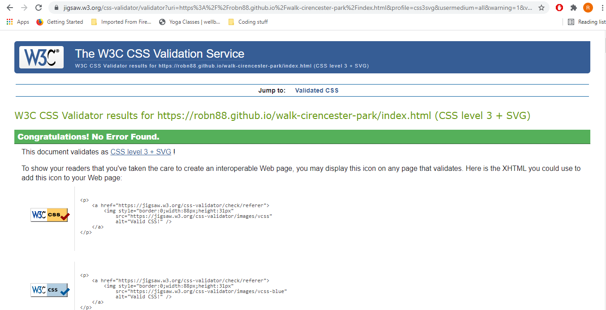

# Walk Cirencester Park

This website is designed for people who may wish to discover more about Cirencester Park, specifically with regards to walking in the park. It attempts to sell the park as a place to visit through the use of photos, and by vaunting its natural beauty. 

## __Features__

### __Existing Features__

__Navigation Bar__
  * A navigation bar that directs to all of the pages is included, which is situated in the same place in on all three pages
    * This will make it easy for people navigate across the site

__Main Image__
  * A striking image, with a text box contained inside, will greet the users when they open the page. This will be at once visually impressive, and informative, giving the key information about the site.

__Why Visit Section__
  * Composed of two tables, each containing 2 images and a small text box, underneath a H2 heading, the goal of the section is to sell the park as a destination

  

__About Section__
* As section that gives all of the practical information one might need in order to visit the park, such as facilities and opening times, and there is a google map iframe with the address already input.

  __Footer__
  * This small section at the bottom of the page, which is repeated across the site, contains links to the main social media platforms.
  * The background color is reused from the cover text on the main image, and features on the ther pages, and reinforces the visual harmony.

  

__Walks Page Main Image__
  * The main image for this page is smaller than that of the main page so that the heading below is visible. Its goal is to further sell the park as a beautiful walking destination.

  

__Walks Page Descriptions__
  * Located underneath a H2 heading that gives the title of the walk, and a H3 heading that gives the overview of the walk.
  * The description of the steps of the walk are divided into two ordered lists, on a background that uses the same color as seen on the index page and in the footer.
  * Photos are located adjacent to reference milestones on the walk.

  

__Map__
* This section contains a static map, with the path traced, and waypoints 1-6, which correspond to the steps of the route.

  __Contact Page__
  * The goal of this page is to allow people to sign up to receive a newsletter, via a form.

### __Features to be Implemented__

__Gallery__
  * A gallery would be a potential feature, allowing more opportunity to showcase the wealth of natural beauty located in the park.
  * It could also contain a feature to submit a photo taken in the park, to be featured on the gallery page.

__Embedded, Interactive Google Maps__
  * It could be useful to have Google Maps embedded below the walk description, with interactivity, for example by placing pins on the map and labelling them according to the stage of the walk they correspond to, as well as previewing a picture that matches the stage of the walk.

### __Testing__

The code has passed through the code validators and no errors were found, as evidenced below:

### Credits

Main image on index.html :
https://www.countrylife.co.uk/out-and-about/cirencester-park-still-full-of-the-amiable-simplicity-of-unadorned-nature-200-years-after-its-creation-216389

deer image
https://www.pexels.com/photo/a-deer-under-a-tree-2877854/

dog walk image
https://www.pexels.com/photo/woman-and-dog-walking-at-woods-1612847/

coffee drinker image
https://www.pexels.com/photo/woman-holding-brown-paper-cup-241558/

tree image
https://images.pexels.com/photos/2861751/pexels-photo-2861751.jpeg

